# CollabCanvas Architecture

**Version:** 0.0.71  
**Last Updated:** 2025-10-19

## Table of Contents

- [System Overview](#system-overview)
- [High-Level Architecture](#high-level-architecture)
- [Component Hierarchy](#component-hierarchy)
- [State Management](#state-management)
- [Real-Time Collaboration](#real-time-collaboration)
- [Firebase Data Structure](#firebase-data-structure)
- [AI Agent Architecture](#ai-agent-architecture)
- [Authentication Flow](#authentication-flow)
- [Key Design Patterns](#key-design-patterns)
- [Data Flow Patterns](#data-flow-patterns)
- [Performance Optimizations](#performance-optimizations)

---

## System Overview

CollabCanvas is a real-time collaborative canvas application built with React, TypeScript, Firebase, and Konva. The architecture emphasizes:

- **Real-time collaboration** via Firestore and Realtime Database
- **Modular component design** with clear separation of concerns
- **Context-based state management** with custom hooks
- **Service layer abstraction** for Firebase operations
- **AI-powered canvas manipulation** via Firebase Functions and OpenAI

---

## High-Level Architecture

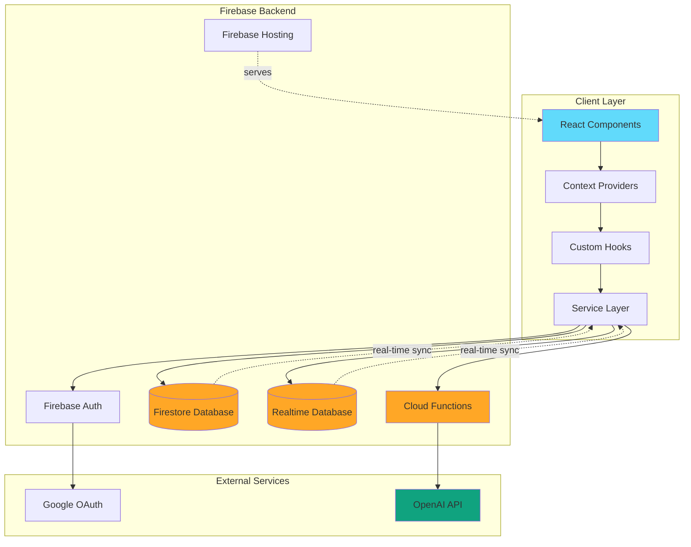

---

## Component Hierarchy

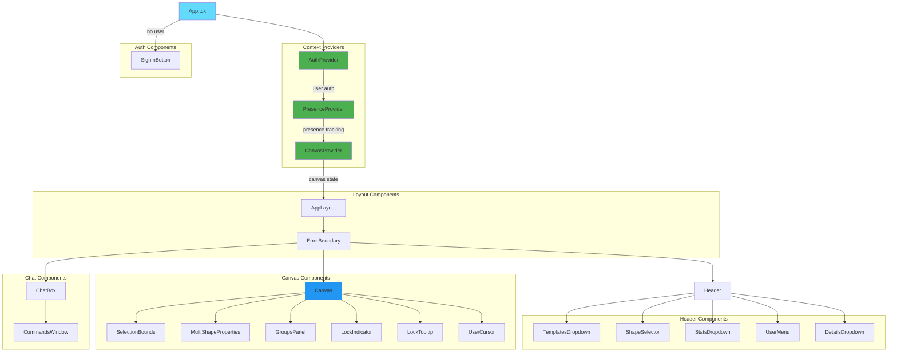

---

## State Management

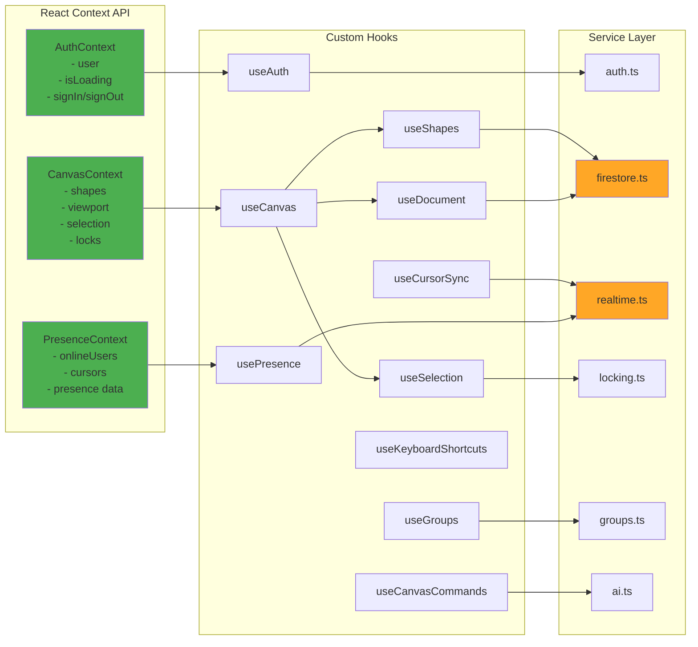

---

## Real-Time Collaboration

### Synchronization Strategy

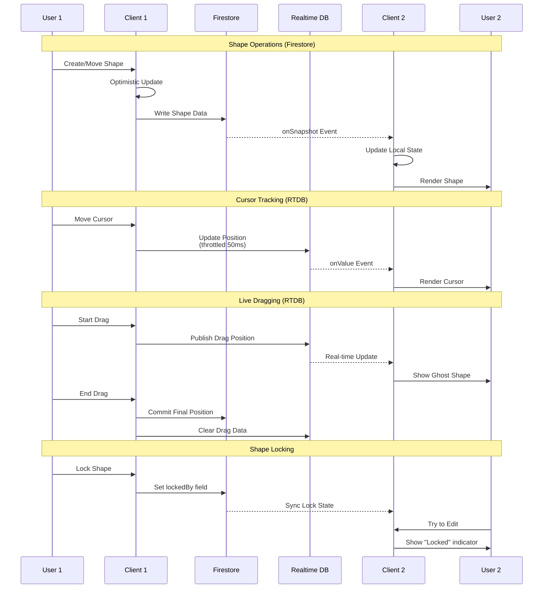

### Real-Time Data Paths

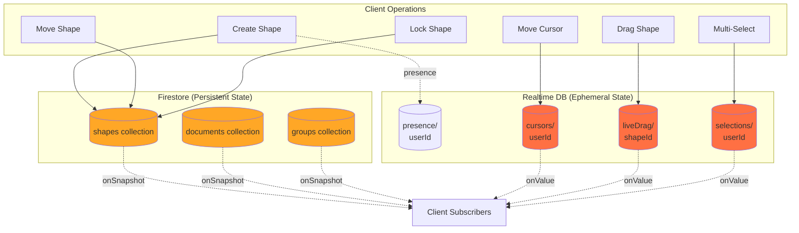

---

## Firebase Data Structure

### Firestore Collections

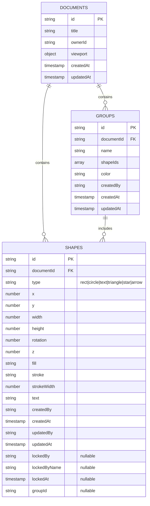

### Realtime Database Structure

```json
{
  "presence": {
    "<userId>": {
      "displayName": "John Doe",
      "color": "#3B82F6",
      "isOnline": true,
      "isActive": true,
      "cursor": {
        "x": 100,
        "y": 200
      },
      "updatedAt": 1729350000000
    }
  },
  "liveDrag": {
    "<shapeId>": {
      "<userId>": {
        "x": 150,
        "y": 250,
        "updatedAt": 1729350000000
      }
    }
  },
  "selections": {
    "<userId>": {
      "shapeIds": ["shape1", "shape2"],
      "color": "#3B82F6",
      "updatedAt": 1729350000000
    }
  }
}
```

---

## AI Agent Architecture

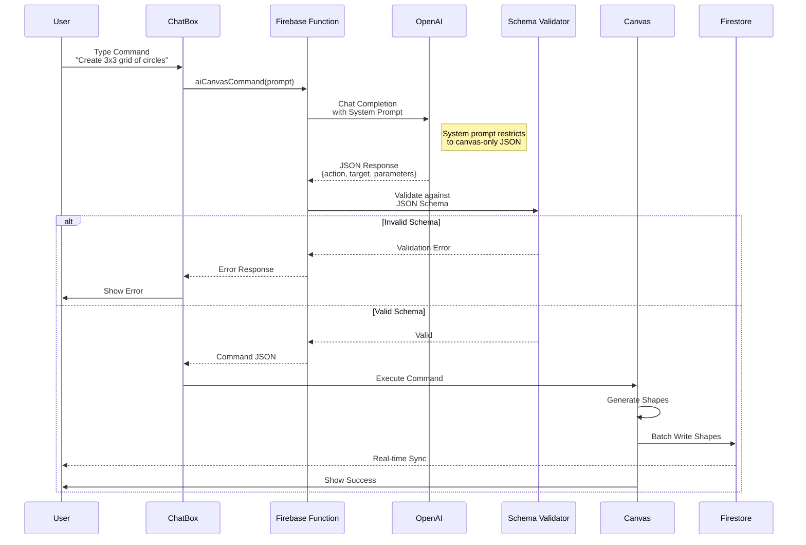

### AI Command Types

```mermaid
graph TD
    AICommands[AI Commands]
    
    AICommands --> Create[Create Actions]
    AICommands --> Manipulate[Manipulate Actions]
    AICommands --> Layout[Layout Actions]
    AICommands --> Complex[Complex Actions]
    
    Create --> CreateShape[Create Shape<br/>- type, color, position]
    Create --> CreateMultiple[Create Multiple<br/>- count, layout]
    
    Manipulate --> SelectShapes[Select Shapes<br/>- by color, type, number]
    Manipulate --> ModifyShapes[Modify Shapes<br/>- color, size, position]
    Manipulate --> RotateShapes[Rotate Shapes<br/>- degrees, direction]
    
    Layout --> GridLayout[Grid Layout<br/>- rows, cols, spacing]
    Layout --> RowLayout[Row Layout<br/>- spacing, alignment]
    Layout --> ColumnLayout[Column Layout<br/>- spacing, alignment]
    
    Complex --> FormGen[Form Generation<br/>- login, signup, contact]
    Complex --> NavbarGen[Navbar Generation<br/>- buttons, items]
    Complex --> TemplateGen[Template Generation<br/>- cards, layouts]
    
    style Create fill:#4caf50
    style Manipulate fill:#2196f3
    style Layout fill:#ff9800
    style Complex fill:#9c27b0
```

---

## Authentication Flow

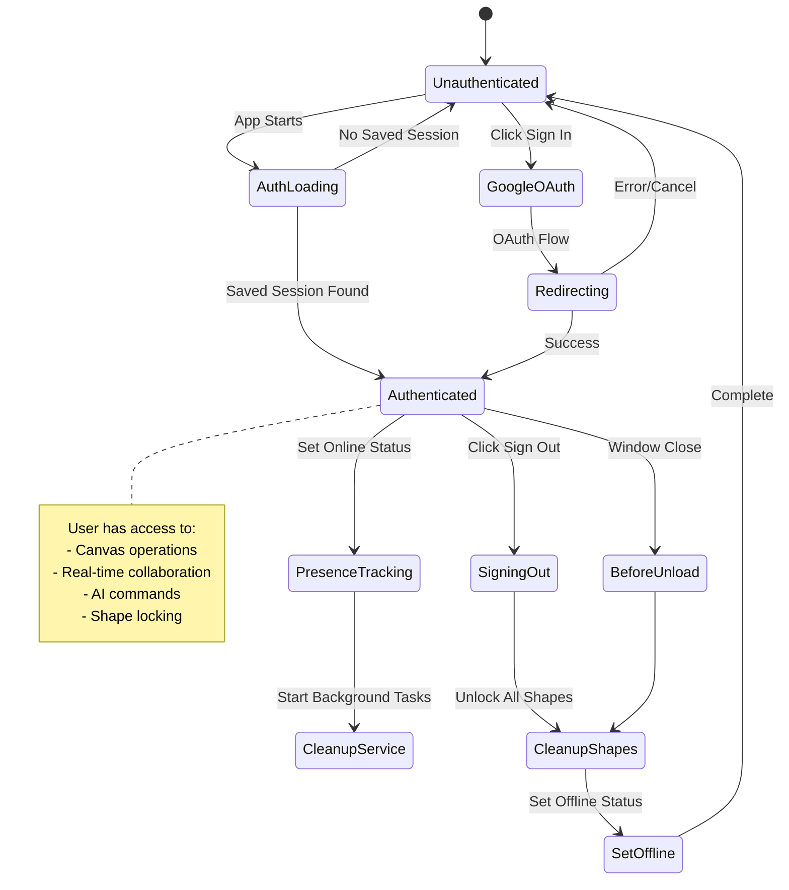

---

## Key Design Patterns

### 1. Context Provider Pattern

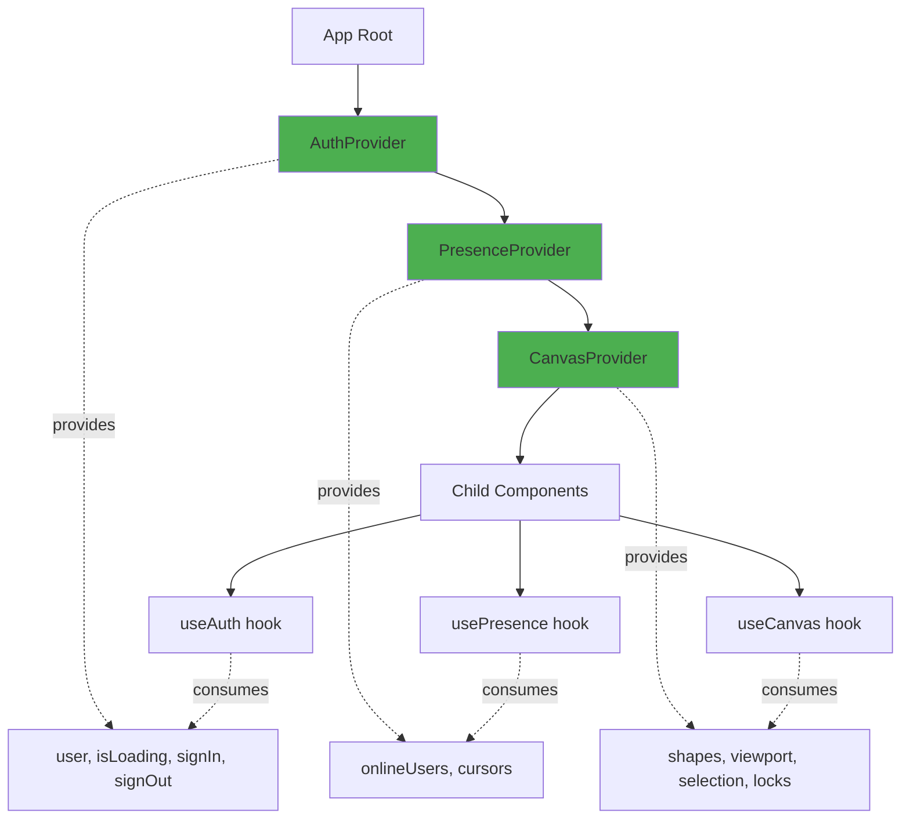

### 2. Service Layer Pattern

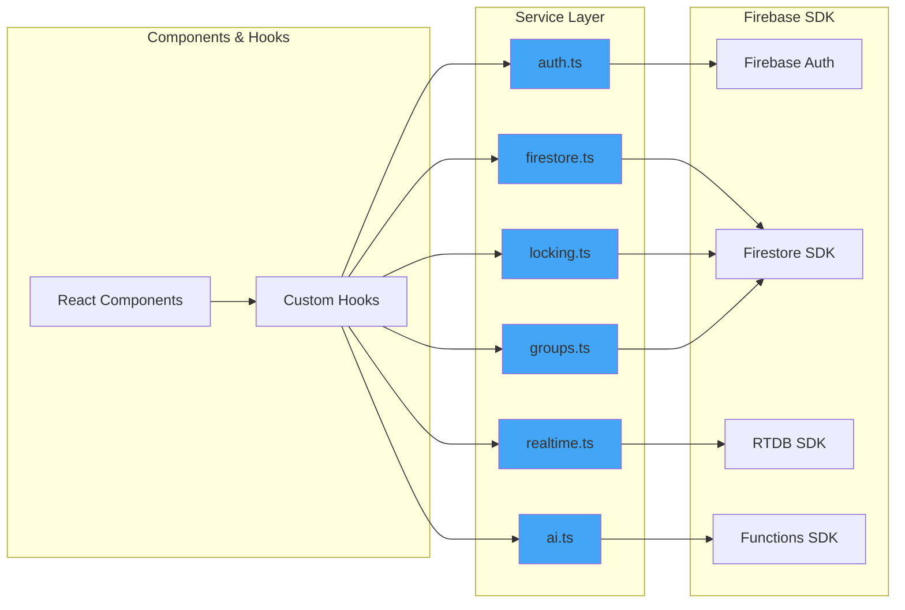

### 3. Optimistic Updates Pattern

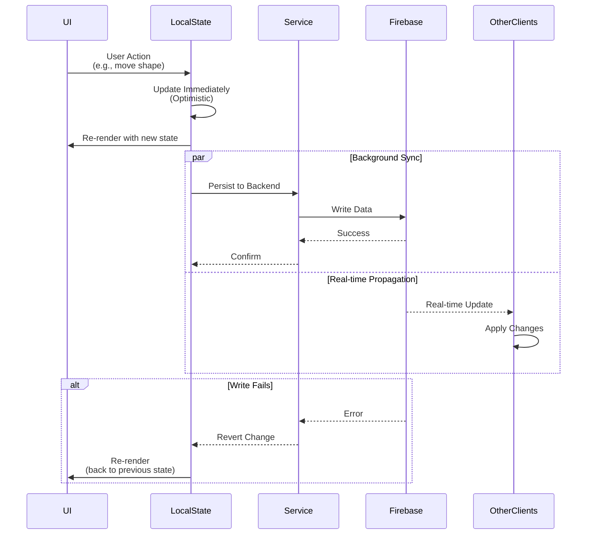

### 4. Custom Hooks Pattern

Custom hooks encapsulate business logic and Firebase interactions:

- **useShapes**: Shape CRUD operations + real-time sync
- **useSelection**: Multi-shape selection logic
- **useDocument**: Document metadata management
- **useGroups**: Group operations + subscriptions
- **useCursorSync**: Cursor position broadcasting
- **useCanvasCommands**: AI command execution
- **useKeyboardShortcuts**: Global keyboard event handling

---

## Data Flow Patterns

### Shape Creation Flow

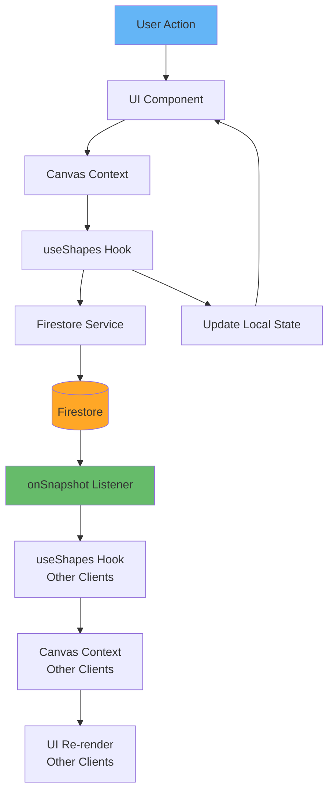

### Multi-Selection Flow

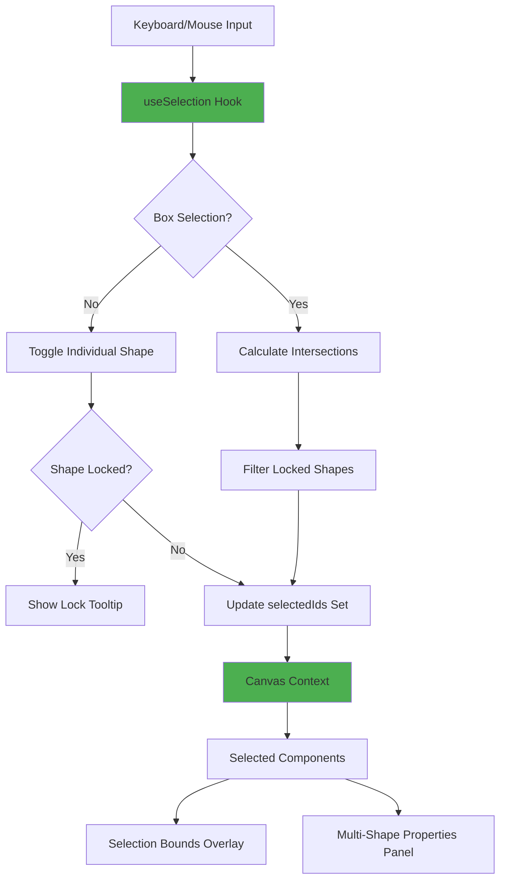

---

## Performance Optimizations

### 1. Throttling & Debouncing

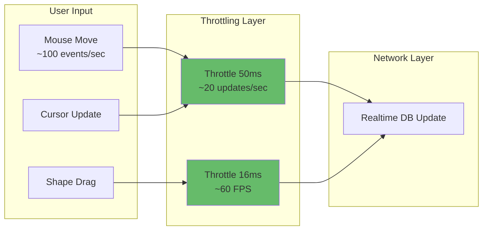

### 2. Memoization Strategy

- **useMemo**: Expensive calculations (shape intersections, bounds)
- **useCallback**: Event handlers passed to child components
- **React.memo**: Expensive components (UserCursor, LockIndicator)
- **Computed properties**: Selection count, shape statistics

### 3. Batch Operations

- Multiple shape updates batched in single Firestore write
- AI-generated shapes written in batches
- Group operations execute as transactions

### 4. Lazy Loading

- Components load on-demand (ChatBox, GroupsPanel)
- Test utilities separated from production bundle
- Firebase Functions cold start optimization

---

## Technology Stack Summary

| Layer | Technology | Purpose |
|-------|------------|---------|
| **Frontend** | React 18.3.1 | UI framework |
| **Language** | TypeScript 5.9.3 | Type safety |
| **Canvas** | Konva 9.3.16 | Shape rendering |
| **Build Tool** | Vite 7.1.14 | Development & bundling |
| **State** | React Context API | Global state management |
| **Backend** | Firebase 11.10.0 | Platform as a Service |
| **Database** | Firestore | Persistent shape data |
| **Real-time** | Realtime Database | Ephemeral presence data |
| **Auth** | Firebase Auth | Google OAuth |
| **Functions** | Cloud Functions | AI agent backend |
| **AI** | OpenAI GPT-3.5 | Natural language processing |
| **Testing** | Jest 29.7.0 | Unit & integration tests |
| **Linting** | ESLint 9.36.0 | Code quality |

---

## Architecture Principles

### 1. **Separation of Concerns**
- Components focus on presentation
- Hooks encapsulate business logic
- Services handle external integrations
- Contexts manage shared state

### 2. **Single Source of Truth**
- Firebase is the authoritative data source
- Local state mirrors backend state
- Optimistic updates for responsiveness

### 3. **Real-Time First**
- All data changes propagate via subscriptions
- Minimal polling, maximum push notifications
- Presence awareness built-in

### 4. **Type Safety**
- TypeScript throughout
- Strict type checking enabled
- Interface definitions for all data structures

### 5. **Scalability**
- Horizontal scaling via Firebase
- Firestore auto-sharding
- Cloud Functions auto-scaling
- Client-side performance optimizations

### 6. **Security**
- Firebase Security Rules enforce access control
- Authentication required for all operations
- AI agent restricted to canvas commands only
- Input validation at multiple layers

---

## Future Architecture Considerations

### Potential Enhancements

1. **WebRTC for P2P Communication**
   - Direct peer-to-peer cursor sync
   - Reduced latency for real-time updates

2. **CRDT Implementation**
   - Conflict-free replicated data types
   - Better offline support
   - Eventual consistency guarantees

3. **WebSocket Fallback**
   - Custom WebSocket server for specialized use cases
   - Fine-grained control over real-time updates

4. **Edge Functions**
   - Move AI processing closer to users
   - Reduced latency for global users

5. **Service Workers**
   - Offline capability
   - Background sync
   - Push notifications

6. **GraphQL API**
   - More flexible data fetching
   - Reduced over-fetching
   - Better caching strategies

---

## Related Documentation

- [Product Requirements (PRD)](docs/prd.md)
- [Firestore Schema](docs/firestore-schema.md)
- [AI Integration PRD](docs/ai-integration-prd.md)
- [Multi-Selection Implementation](MULTI_SELECTION_IMPLEMENTATION_SUMMARY.md)
- [README](README.md)

---

**Maintained by:** CollabCanvas Team  
**Architecture Version:** 1.0.0  
**Application Version:** 0.0.71

